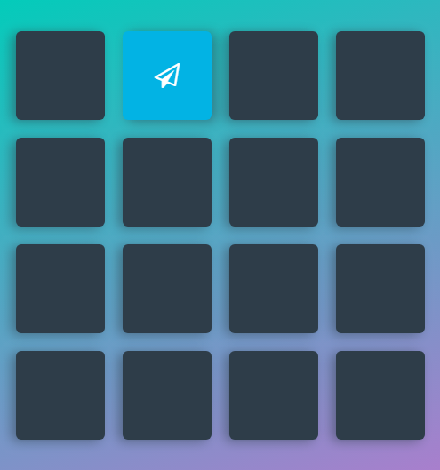
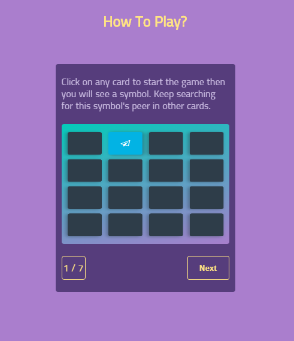
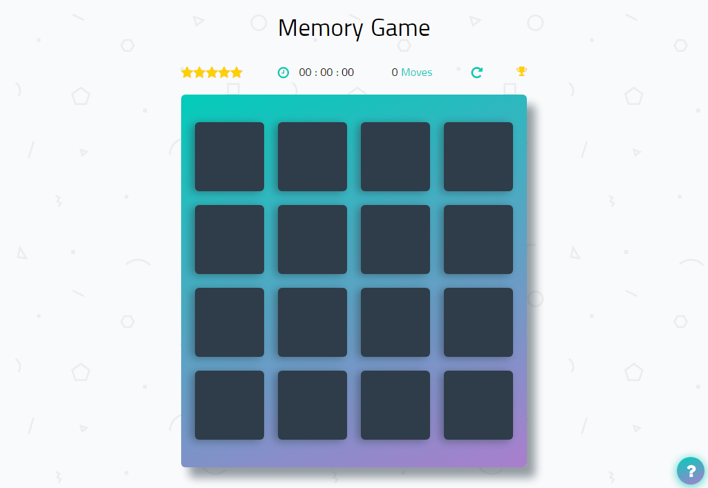

# FEND MEMORY GAME
Udacity (Front-End Web Developer Nanodegree Project): Memory Game.

## Content Table
* [About The Game](#about-the-game)
* [How Does The Game Work?](#how-does-the-game-work)
* [How To play?](#how-to-play)
* [Features](#features)
* [Screenshots](#screenshots)
* [Libraries](#libraries)

## About The Game
A Browser-based Card Matching Game, rely on JavaScript without any external libraries.

## How Does The Game Work?
The game board consists of sixteen "cards" arranged in a grid. The deck is made up of eight different pairs of cards, each with different symbols on one side. The cards are arranged randomly on the grid with the symbol face down. The gameplay rules are very simple: flip over two hidden cards at a time to locate the ones that match.

## How To Play?
* Open [Memory Game](https://hamadafayad.github.io/memory-card-project/) or [clone](https://github.com/hamadafayad/memory-card-project) it.

* Enter your name and click start game to start playing.

* Click on any card and you will see a symbol.

* Keep searching for this symbol's peer in other cards.

* When you find the right one, both of them will stay flipped and mark as matched.

* If you didn't find it, both of them will filp back again.

* The game ends once all cards have been correctly matched.

* Try to finish the game in as less moves as possible to get a better rate.

## Features
* Stars rating system based on moves number.
* Timer To count how many time did you take to finish the game.
* Moves counter (Every two flipped cards equal one move).
* Restart game button.
* Latest five scores board.

* How to play button to guide the gamers to how the game work.

## Screenshots
* Memory Game.

* Finish Game Successfully.

## Libraries
* [Jquery](https://jquery.com/)
* [FontAwesome](https://fontawesome.com/v4.7.0/)
